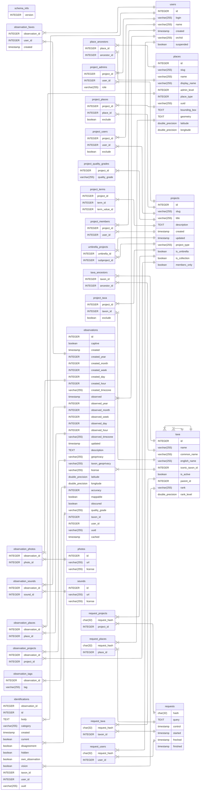

# README

## DB

```mermaid
---
config:
  layout: elk
---
erDiagram
    direction LR
    "schema_info" {
        INTEGER version
    }
    "users" {
        INTEGER id
        varchar(255) login
        varchar(255) name
        timestamp created
        varchar(255) orchid
        boolean suspended
    }
    "places" {
        INTEGER id
        varchar(255) slug
        varchar(255) name
        varchar(255) display_name
        INTEGER admin_level
        INTEGER place_type
        varchar(255) uuid
        TEXT bounding_box
        TEXT geometry
        double_precision latitude
        double_precision longitude
    }
    "place_ancestors" {
        INTEGER place_id
        INTEGER ancestor_id
    }
    "projects" {
        INTEGER id
        varchar(255) slug
        varchar(255) title
        TEXT description
        timestamp created
        timestamp updated
        varchar(255) project_type
        boolean is_umbrella
        boolean is_collection
        boolean members_only
    }
    "project_admins" {
        INTEGER project_id
        INTEGER user_id
        varchar(255) role
    }
    "project_places" {
        INTEGER project_id
        INTEGER place_id
        boolean exclude
    }
    "project_users" {
        INTEGER project_id
        INTEGER user_id
        boolean exclude
    }
    "project_quality_grades" {
        INTEGER project_id
        varchar(255) quality_grade
    }
    "project_terms" {
        INTEGER project_id
        INTEGER term_id
        INTEGER term_value_id
    }
    "project_members" {
        INTEGER project_id
        INTEGER user_id
    }
    "umbrella_projects" {
        INTEGER umbrella_id
        INTEGER subproject_id
    }
    "taxa" {
        INTEGER id
        varchar(255) name
        varchar(255) common_name
        varchar(255) english_name
        INTEGER iconic_taxon_id
        boolean is_active
        INTEGER parent_id
        varchar(255) rank
        double_precision rank_level
    }
    "taxa_ancestors" {
        INTEGER taxon_id
        INTEGER ancestor_id
    }
    "project_taxa" {
        INTEGER project_id
        INTEGER taxon_id
        boolean exclude
    }
    "observations" {
        INTEGER id
        boolean captive
        timestamp created
        INTEGER created_year
        INTEGER created_month
        INTEGER created_week
        INTEGER created_day
        INTEGER created_hour
        varchar(255) created_timezone
        timestamp observed
        INTEGER observed_year
        INTEGER observed_month
        INTEGER observed_week
        INTEGER observed_day
        INTEGER observed_hour
        varchar(255) observed_timezone
        timestamp updated
        TEXT description
        varchar(255) geoprivacy
        varchar(255) taxon_geoprivacy
        varchar(255) license
        double_precision latitude
        double_precision longitude
        INTEGER accuracy
        boolean mappable
        boolean obscured
        varchar(255) quality_grade
        INTEGER taxon_id
        INTEGER user_id
        varchar(255) uuid
        timestamp cached
    }
    "observation_faves" {
        INTEGER observation_id
        INTEGER user_id
        timestamp created
    }
    "photos" {
        INTEGER id
        varchar(255) url
        varchar(255) license
    }
    "observation_photos" {
        INTEGER observation_id
        INTEGER photo_id
    }
    "sounds" {
        INTEGER id
        varchar(255) url
        varchar(255) license
    }
    "observation_sounds" {
        INTEGER observation_id
        INTEGER sound_id
    }
    "observation_places" {
        INTEGER observation_id
        INTEGER place_id
    }
    "observation_projects" {
        INTEGER observation_id
        INTEGER project_id
    }
    "observation_tags" {
        INTEGER observation_id
        varchar(255) tag
    }
    "identifications" {
        INTEGER observation_id
        INTEGER id
        TEXT body
        varchar(255) category
        timestamp created
        boolean current
        boolean disagreement
        boolean hidden
        boolean own_observation
        boolean vision
        INTEGER taxon_id
        INTEGER user_id
        varchar(255) uuid
    }
    "requests" {
        char(32) hash
        TEXT query
        timestamp control
        timestamp started
        timestamp freshed
        timestamp finished
    }
    "request_projects" {
        char(32) request_hash
        INTEGER project_id
    }
    "request_places" {
        char(32) request_hash
        INTEGER place_id
    }
    "request_taxa" {
        char(32) request_hash
        INTEGER taxon_id
    }
    "request_users" {
        char(32) request_hash
        INTEGER user_id
    }
    "place_ancestors" }|--|| "places" : ""
    "place_ancestors" }|--|| "places" : ""
    "project_admins" }|--|| "users" : ""
    "project_admins" }|--|| "projects" : ""
    "project_places" }|--|| "places" : ""
    "project_places" }|--|| "projects" : ""
    "project_users" }|--|| "users" : ""
    "project_users" }|--|| "projects" : ""
    "project_quality_grades" }|--|| "projects" : ""
    "project_terms" }|--|| "projects" : ""
    "project_members" }|--|| "users" : ""
    "project_members" }|--|| "projects" : ""
    "umbrella_projects" }|--|| "projects" : ""
    "umbrella_projects" }|--|| "projects" : ""
    "taxa" }|--|| "taxa" : ""
    "taxa" }|--|| "taxa" : ""
    "taxa_ancestors" }|--|| "taxa" : ""
    "taxa_ancestors" }|--|| "taxa" : ""
    "project_taxa" }|--|| "taxa" : ""
    "project_taxa" }|--|| "projects" : ""
    "observations" }|--|| "users" : ""
    "observations" }|--|| "taxa" : ""
    "observation_faves" }|--|| "users" : ""
    "observation_faves" }|--|| "observations" : ""
    "observation_photos" }|--|| "photos" : ""
    "observation_photos" }|--|| "observations" : ""
    "observation_sounds" }|--|| "sounds" : ""
    "observation_sounds" }|--|| "observations" : ""
    "observation_places" }|--|| "places" : ""
    "observation_places" }|--|| "observations" : ""
    "observation_projects" }|--|| "projects" : ""
    "observation_projects" }|--|| "observations" : ""
    "observation_tags" }|--|| "observations" : ""
    "identifications" }|--|| "users" : ""
    "identifications" }|--|| "taxa" : ""
    "identifications" }|--|| "observations" : ""
    "request_projects" }|--|| "projects" : ""
    "request_projects" }|--|| "requests" : ""
    "request_places" }|--|| "places" : ""
    "request_places" }|--|| "requests" : ""
    "request_taxa" }|--|| "taxa" : ""
    "request_taxa" }|--|| "requests" : ""
    "request_users" }|--|| "users" : ""
    "request_users" }|--|| "requests" : ""
```
