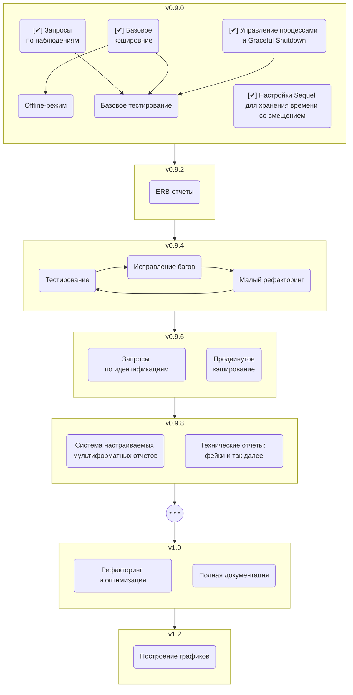

```mermaid
flowchart TB

  subgraph R090 ["v0.9.0"]
    direction TB
    Observs("[✔] Запросы<br>по наблюдениям")
    Caching("[✔] Базовое<br>кэшировние")
    Shutdown("[✔] Управление процессами и Graceful Shutdown")
    Timing("[✔] Настройки Sequel для хранения времени со смещением")
    Offline("Offline-режим")
    BaseTesting("Базовое тестирование")
  end

  subgraph R092 ["v0.9.2"]
    direction TB
    ERB("ERB-отчеты")
  end

  subgraph R094 ["v0.9.4"]
    direction LR
    Testing("Тестирование")
    Debugging("Исправление багов")
    Ref1("Малый рефакторинг")
  end

  subgraph R096 ["v0.9.6"]
    direction TB
    Idents("Запросы по идентификациям")
    AdvCaching("Продвинутое<br>кэширование")
  end

  subgraph R098 ["v0.9.8"]
    direction TB
    Reporting("Система настраиваемых мультиформатных отчетов")
    TechReps("Технические отчеты: фейки и так далее")
  end

  Smth(("• • •"))

  subgraph R100 ["v1.0"]
    direction TB
    Refactoring("Рефакторинг и оптимизация")
    Documenting("Полная документация")
  end

  subgraph R120 ["v1.2"]
    direction TB
    Graphics("Построение графиков")
  end

  R090 --> R092
  R092 --> R094
  R094 --> R096
  R096 --> R098
  R098 --> Smth
  Smth --> R100
  R100 --> R120

  Caching --> Offline
  Observs --> BaseTesting
  Caching --> BaseTesting
  Shutdown --> BaseTesting

  Testing --> Debugging
  Debugging --> Ref1
  Ref1 --> Testing
```
