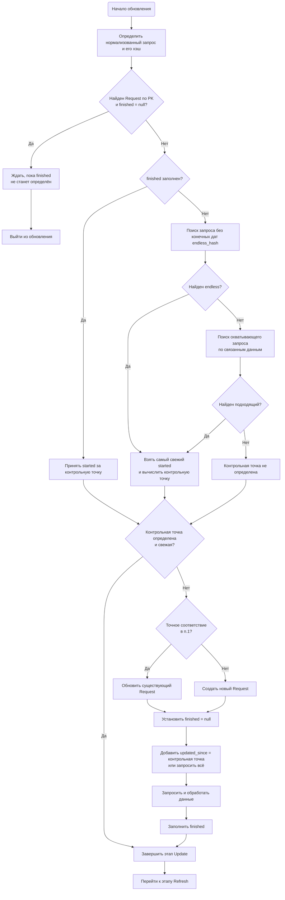

# Схема обновления

## Этап 1. Update



1. Определяем нормализованный запрос и его хэш.
   ```ruby
   sorted = value.compact.transform_values { |v| v.is_a?(Enumerable) ? v.sort : v }
   json = JSON.stringify sorted, sort_keys: true, space: ''
   hash = Digest::MD5.hexdigest json
   ```
   Ищем `Request` по первичному ключу, равному получившемуся хэшу. Если находим, и его поле `finished` установлено в `null`, ждем, время от времени засыпая,
   пока оно не будет выставлено во что-то определенное и выходим из обновления — за нас все сделал другой процесс.

   _Нужно предусмотреть какую-то очистку незавершенных запросов... Вероятно, это стоит делать при старте скрипта — до запуска воркеров._

   Если поле `finished` объекта `Request` изначально заполнено, то берем за контрольную точку его поле `started` и переходим к пункту 4.

2. Если не найден запрос с тем же PK, ищем запрос, отличающийся только финальными датами.
   
   Для этого формируем нормализованный запрос без этих дат и его хэш.
   ```ruby
   endless = sorted.reject { |k, v| k == :d1 || k == :created_d2 }
   endless_json = JSON.stringify endless, sort_keys: true, space: ''
   endless_hash = Digest::MD5.hexdigest endless_json
   ```
   Выбираем `Request` по полю `endless` — самый свежий по полю `started`. Если таковой есть, за контрольную точку принимаем _самое старое_ значение из:
   поля `started` у `Request`, полей `d2` и `created_d2`, полученных из поля `query`, если таковые есть, и переходим к пункту 4.

3. Если ничего не найдено, пытаемся найти охватывающий запрос. Для чего получаем отсортированные по `started` объекты `Request` согласно связям с проектами,
   местами, пользователями и таксонами, сохраненными в таблицах связей. _Выбранные проверяем на полный охват, игнорируя только конечные даты_. 
   Чтобы не замедлять работу слишком сильно, ограничиваем выборку еще до проверки. Если найден подходящий, контрольную точку вычисляем так же, 
   как в предыдущем пункте.

4. Если контрольная точка определена и отстоит от текущего времени менее, чем на `config:caching/update`, успокаиваемся и завершаем текущий этап 
   и вообще обновление.

   Иначе:

   + Если мы получили точное соответствие в первом пункте, то обновляем объект `Request`, иначе создаем новый. Устанавливаем `finished` в `null` 
     и записываем в базу. В новом заполняем поле `freshed` равным `started`, в уже существующем не трогаем.

   + Формируем запрос, добавив к исходному `updated_since` установленный в контрольную точку, если таковая определена, иначе запрашиваем все данные по запросу.
     Запрашиваем и парсим результат.

   + Обновляем объект `Request`, заполнив поле `finished`.

## Этап 2. Refresh

